# How WebKit is Built

*Bill Ming*

WebKit building system is pretty complex. Basically it is a system build on top of XCode projects and make files. On platform other than Mac or IOS, CMake is used instead of XCode project.

## Project Naming


### WebKit

The *WebKit* project actually means what we normally called *WebKit2*, which is a new multi-process based API design.

### WebKitLegacy

It is what we usually called *WebKit*, which is a old single-process based API.  
I will use **WebKit** and **WebKitLegacy** instead of *WebKit2* and *WebKit* in the following sections.

## Build Targets


### MiniBrowser

*MiniBrowser* is a simple browser interface for testing purpose. You may consider it as a simplified Safari.

### WebKit
As described before, it's the new *WebKit2* API.

### WebKitLegacy

It's the old *WebKit* API.

### WebCore

One of the *core* of the web engine. It is responsible for page layout, rendering and so on.

### JavaScriptCore

Another *core* of the web engine. As the name suggests, it is the place where JavaScript code is handled.

### WTF

The *Web Template Framework*. In early days, it's a part of JavaScriptCore, but after being used commonly in other WebKit components like WebCore and WebKit, it is moved out of JavaScriptCore.

### ANGLE

> A conformant OpenGL ES implementation for Windows, Mac and Linux.

### PAL

A new library split from WebCore to provide a better layer of platform abstraction.

### Other components

- libwebrtc
- Dumprendertree
- WebKitTestRunner
- bmalloc


## Dependencies


The dependency tree contains some of the major ports of the whole build process. Some trivial steps are simply ignored.



## Bottom-up Build Process


### bmalloc

The project is relatively simple. No special step in here.

### Compile bmalloc Sources

### Copy Private Headers
```sh
PRIVATE_HEADERS_FOLDER_PATH = /usr/local/include/bmalloc;
```
This step copies all *bmalloc* header files into the `PRIVATE_HEADERS_FOLDER_PATH` under temporary output folder. On Mac, it is `DerivedData/WebKit/Build/Products/Debug` by default.

*bmalloc* does not have any public header.

This step is run **after** building bmalloc.

### WTF

#### Copy WTF Headers
This step is run **Before** Building WTF.

Just like bmalloc, this step copies all headers _(*.h)_ under WTF into `usr/local/include/wtf` with the same directory structure.
```shell
if [[ "${DEPLOYMENT_LOCATION}" == "NO" ]]; then
    PRIVATE_HEADERS_PATH="${TARGET_BUILD_DIR%/}/${PRIVATE_HEADERS_FOLDER_PATH}"
else
    PRIVATE_HEADERS_PATH="${DSTROOT}${INSTALL_PATH_PREFIX%/}/${PRIVATE_HEADERS_FOLDER_PATH}"
fi;

mkdir -p "${PRIVATE_HEADERS_PATH}"
rsync -av --no-owner --no-group --prune-empty-dirs --exclude ".svn" --exclude "usr" --exclude "DerivedSources" --include "*/" --include "*.h" --exclude "*" "${SRCROOT}/wtf/" "${PRIVATE_HEADERS_PATH}"
```

#### Compile WTF Sources.

#### Copy *Private* Headers.

Most of the WTF headers are copied before compilation. Only two *private* headers are exceptions: `OrinalNumber.h` and `MemoryFootprint.h`.

### JavaScriptCore


#### Derived Sources

In this step, xcode project invokes a make file: 
```sh
make --no-builtin-rules -f "JavaScriptCore/DerivedSources.make" -j `/usr/sbin/sysctl -n hw.ncpu`
```
to update several targets, including:
```makefile
all : \
    udis86_itab.h \
    Bytecodes.h \
    CombinedDomains.json \
    InitBytecodes.asm \
    InjectedScriptSource.h \
    InspectorFrontendDispatchers.h \
    JSReplayInputs.h \
    JSCBuiltins.h \
    Lexer.lut.h \
    KeywordLookup.h \
    RegExpJitTables.h \
    AirOpcode.h \
    YarrCanonicalizeUnicode.cpp \
    WasmOps.h \
    WasmValidateInlines.h \
    WasmB3IRGeneratorInlines.h \
```

##### Generate `usid86_itab.h`
```
udis86_itab.h: $(JavaScriptCore)/disassembler/udis86/ud_itab.py $(JavaScriptCore)/disassembler/udis86/optable.xml
	$(PYTHON) $(JavaScriptCore)/disassembler/udis86/ud_itab.py $(JavaScriptCore)/disassembler/udis86/optable.xml .
```

##### Generate `.lut.h` files.
Generate Hash tables.
```
$(OBJECT_LUT_HEADERS): %.lut.h : %.cpp $(JavaScriptCore)/create_hash_table
	$(PERL) $(JavaScriptCore)/create_hash_table $< > $@
```

##### Generate `InspectorFrontendDispatchers.h/cpp`
```
python JavaScriptCore/Scripts/UpdateContents.py 'JavaScriptCore/inspector/protocol/ApplicationCache.json JavaScriptCore/inspector/protocol/CSS.json
...
JavaScriptCore/inspector/protocol/Memory.json JavaScriptCore/inspector/protocol/Replay.json' EnabledInspectorDomains
```
This step will first write the command line parameter string within __'__ __'__ into the file `DerivedData/WebKit/Build/Products/Debug/DerivedSources/JavaScriptCore/EnabledInspectorDomains`.  
The next step is to update `DerivedData/WebKit/Build/Products/Debug/DerivedSources/JavaScriptCore/CombinedDomains.json` with `generate-combined-inspector-json.py`.
Lastly, the `generate-inspector-protocol-bindings.py` will generate two files:  
`InspectorFrontendDispatchers.h` and `InspectorFrontendDispatchers.cpp` with previously generated intermediate files.

*Please read `DerivedSources.make` for other trivial generated files*


#### *Generate LLIntDesiredOffsets.h*
This step generates the `LLIntDesiredOffsets.h` which will be used to compile the next target `LLIntOffsetsExtractor`.  
In this step, the `LowLevelInterpreter.asm` and its included `.asm` files are parsed by `generate_offset_extractor.rb`, then all of the symbols referenced in `.asm` will be collected into the final output `LLIntDesiredOffsets.h`.

```
mkdir -p "${BUILT_PRODUCTS_DIR}/LLIntOffsets/"

/usr/bin/env ruby "${SRCROOT}/offlineasm/generate_offset_extractor.rb" "-I${BUILT_PRODUCTS_DIR}/DerivedSources/JavaScriptCore" "${SRCROOT}/llint/LowLevelInterpreter.asm" "${BUILT_PRODUCTS_DIR}/LLIntOffsets/LLIntDesiredOffsets.h" "X86,X86_64,ARMv7,ARMv7s,ARM64,C_LOOP"
```

The temporary file is located in `DerivedData/WebKit/Build/Products/Debug/LLIntOffsets/LLIntDesiredOffsets.h`

*This file needs to be regenerated only when `*.asm` files are changed.*

#### *JSCLLIntOffsetsExtractor*

This step compile and link the `LLIntOffsetsExtractor.cpp` into a platform-specific binary format.  
The purpose of generating the `JSCLLIntOffsetsExtractor` target is to transform all the symbols in `LLIntDesiredOffsets.h` into a actual address within the binary image, so that in the next step a parser can read this binary and extract the exact offset of a symbol.

*This step needs to be run whenever a symbol address is changed. Normally when you change a structure by adding or removing some elements, some of its member offsets will change and if the member is used by `*.asm`, you would have to redo this step. So, basically it boils down to the rule: run this step again whenever you changed JSC sources.*

#### *Offline Assembler*
Extract platform-specific symbol offsets from `JSCLLIntOffsetsExtractor` binary and put into `LLIntAssembly.h`
```
/usr/bin/env ruby JavaScriptCore/offlineasm/asm.rb "-I${BUILT_PRODUCTS_DIR}/DerivedSources/JavaScriptCore" JavaScriptCore/llint/LowLevelInterpreter.asm "${BUILT_PRODUCTS_DIR}/JSCLLIntOffsetsExtractor" LLIntAssembly.h
```

*The step needs rerun if JSCLLIntOffsetsExtractor has changed*.  
*More details of how the `offsets extractor` works will be elaborated in another article.*

#### *Copy Headers*

Copy all *Public* and *Private* headers.

#### *Compile JavaScriptCore Sources*

#### *Post Process Headers*
`unifdef` some of the macros.
```
exec ${SRCROOT}/postprocess-headers.sh
```
Input files: `JSBase.h, JSContext.h, JSManagedValue.h, JSValue.h, JSVirtualMachine.h, WebKitAvailability.h`


### WebCore


#### PAL

*PAL* stands for *Platform abstraction layer*

This is a newly added component, mostly for abstracting platform API for the other WebCore components.  
This library is still very simple, so I will ignore its build process.

#### Derived Sources
```
WebCore/DerivedSources.make
```
##### Generate JavaScript Binding IDLs
Considering the complexity, there will be another article about how the IDL bindings are generated.

##### Generate Other Sources
- `CSSPropertyNames.h CSSPropertyNames.cpp StyleBuilder.cpp StylePropertyShorthandFunctions.h StylePropertyShorthandFunctions.cpp`
- `CSSValueKeywords.h CSSValueKeywords.cpp`
- `DOMJITAbstractHeapRepository.h`
- `XMLViewerCSS.h`
- `XMLViewerJS.h`
- `SDPProcessorScriptsData.h`
- `UserAgentScripts.h`
- `WebKitFontFamilyNames.cpp WebKitFontFamilyNames.h`
- `JSHTMLElementWrapperFactory.cpp JSHTMLElementWrapperFactory.h HTMLElementFactory.cpp HTMLElementFactory.h HTMLElementTypeHelpers.h HTMLNames.cpp HTMLNames.h`
- `JSSVGElementWrapperFactory.cpp JSSVGElementWrapperFactory.h SVGElementFactory.cpp SVGElementFactory.h SVGElementTypeHelpers.h SVGNames.cpp SVGNames.h`
- `EventFactory.cpp EventHeaders.h EventInterfaces.h`
- `EventTargetHeaders.h EventTargetInterfaces.h`
- `ExceptionCodeDescription.cpp ExceptionCodeDescription.h ExceptionHeaders.h ExceptionInterfaces.h`
- `JSMathMLElementWrapperFactory.cpp JSMathMLElementWrapperFactory.h MathMLElementFactory.cpp MathMLElementFactory.h MathMLElementTypeHelpers.h MathMLNames.cpp MathMLNames.h`
- `InternalSettingsGenerated.idl InternalSettingsGenerated.cpp InternalSettingsGenerated.h SettingsMacros.h`
- `InspectorOverlayPage.h`
- `CommandLineAPIModuleSource.h`
- `WebReplayInputs.h`

#### *Copy Headers and Resources*

1. Copy *public* and *private* headers.
1. Copy *Generated* headers: `CSSPropertyNames.h, CSSValueKeyworkds.h, HTMLNames.h, JSDOMWindow.h, JSNode.h, SettingsMacros.h, SVGNames.h, WebKitFontFamilyNames.h`.
1. Copy *Forwarding* (`$SRCROOT/ForwardingHeaders`) and *ICU* (`$SRCROOT/icu`) headers.
1. Copy some scripts into `WebCore.framework/Versions/A/PrivateHeaders/Scripts`.
1. Copy *Bundle Resources* into `WebCore.framework/Versions/A/Resources/`.
1. Copy audio resources.

#### Compile Sources

### WebInspectorUI

The goal of this step is to copy some resources (`localizedString.js` and so on).
```
/usr/bin/perl "${SRCROOT}/Scripts/copy-user-interface-resources.pl"
```
The dummy `WebInspectorUI.c` is only used to create a linkable framework library.

### WebKitLegacy

#### *Migrate Headers*
`exec "${SRCROOT}/mac/migrate-headers.sh"` with input `MigrateHeaders.make`

#### *Post Process Headers*
`exec "${SRCROOT}/mac/postprocess-headers.sh"`

#### *Copy Headers*
WebKitLegacy does not have *public* headers, therefore only private headers are copied.

#### *Copy Bundle Rresources*
Copy some resource files into `WebKitLegacy.framework/Versions/A/Resources`.

#### *Compile Sources*

### WebKit

#### *Derived Sources*
```
make --no-builtin-rules ${MAKEFILE_INCLUDE_FLAGS} -f "${WebKit2}/DerivedSources.make" -j `/usr/sbin/sysctl -n hw.activecpu` SDKROOT=${SDKROOT}
```

#### *Process Shim*
Not like the WebKitLegacy, WebKit (i.e. WebKit2) is designed to be run in multi-process mode, just like what Chromium does.  
The processes consists of the UIProcess, WebProcess, PluginProcess and so on.

#### *Migrate WebKitLegacy Headers*
```
make -C mac -f "MigrateHeadersFromWebKitLegacy.make" -j `/usr/sbin/sysctl -n hw.activecpu`
```

#### *Copy Headers and Resources*

#### *Compile Sources*

### MiniBrowser

It's just a simple UI for WebKit.

