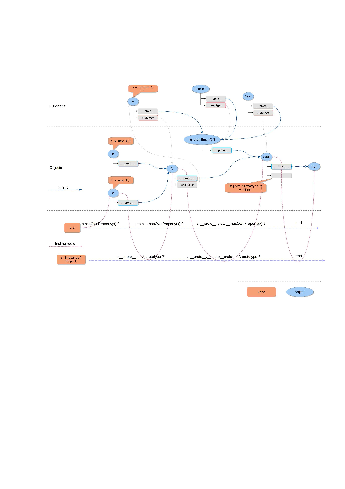

# WebKit的编译过程

## 背景知识

一个大型的项目对内部不同组件之间的关系的维护是非常重要的。有一种常见的称呼叫做spaghetti code，就是指代码像意大利面条一样缠在一起没法分割。互相之间有非常强的耦合性以至于后期的重构，功能的增删都变得极其困难。

对C/C++项目来说spaghetti code体现在代码之间的循环引用，代码分层不清，以及设计架构上的对象所有权关系混乱。

**循环引用**

一种循环引用的情况是头文件之间的引用循环。比如`a.h`包含了`b.h`，然后`b.h`又直接或者间接的包含了`a.h`。在大型项目中头文件包含的层次往往非常深，所以在往一个头文件里面添加`#include`宏的时候很难判断当中是不是有循环引用。而循环引用有时候并不一定会出错，但是一旦在后期出现错误，需要再回到当初的修改来取消循环的代价又很大。

一般来说有几个办法避免这种问题：

- 优先在cpp文件中加入头文件。比如可以让`a.c`包含`b.h`的话就不要在`a.h`中包含。
- 使用forward declaration。这种方法偶尔会被用来破除引用循环，但是会导致声明不在同一个地方，增加维护成本。
- 尽量减少引用层级。比如减少没有必要的抽象化，如果`a.h`和`b.h`都属于某个功能，那把他们都放进`features.h`可能更好。

**代码分层**

清晰的代码的层次关系不仅仅会让维护变得方便，也会让不熟悉的项目的人更快的理解和参与。同时他们提交的修改也更加安全，因为局部的修改不太会牵一发而动全身。层次关系也会让单元测试变得方便，因为单元测试往往可以通过上下层之间的接口进行，让测试和实际代码更加解耦。

代码分层体现在两个方面

- 组件之间的层级关系
- 组件内部的层级关系

例如WebCore依赖JSC，那么这种依赖就是单向的，也就意味着WebCore可以访问JSC的头文件，而JSC无法访问WebCore头文件。我们知道JSC和WebCore都需要被编译成动态链接库，所以如果有反向依赖的话我们就会遇到链接错误。有些时候很多项目图个省事就会把所有东西全都编译到一起去，这其实是一个非常不好的习惯。因为边界一旦打破，后面再想修复的话成本会变得极高。

**隐藏内部实现**

一般来说一个组件如果被编译成动态或者静态库文件，那么其他组件使用的时候只需要包含相应的头文件，然后链接到库即可。有些项目会提供一个`include`目录，把所有对外可见的头文件放到这个目录下面。这样就避免了项目内部的头文件被有意或者无意的暴露出去。

这里依然会存在一个anti-pattern，就是把项目本身的代码目录当作包含路径暴露给所有依赖的库。这样做有几个坏处：

- 坏处之一：项目本身的根目录暴露给所有依赖的库以后就相当于暴露了所有头文件，这时候内部实现就完全暴露了。组件之间不再有一个清晰的层级关系。

这个怎么理解呢？举个例子，比如组件`b`依赖组件`a`，那么`b`和`a`的关系是“*b和a之间通过暴露在头文件种的API沟通*”。也就是说头文件和它内部的声明构成了一个contract（合同）。上下游组件之间依靠这个合同来协作，测试用例则以覆盖所有合同中的定义为标准。这个合同必须相对稳定并且易于维护。同时对于C/C++项目来说这个API contract也是保证ABI兼容的一部分。例如有些C++项目也会以`extern C`来声明导出函数。

如果失去了这一层API contract而直接把项目根目录暴露出去，那么所有内部定义都可以被使用，甚至内部定义的编译结果在不同组件当中会不一样。参考下面的代码：

```
// a.h
struct a {
#ifdef COMPONENT_A_INTERNAL_FLAG
    int x;
#endif
    int y;
};
```

这时候定义或者不定义`COMPONENT_A_INTERNAL_FLAG`会影响结构体的大小。那么如果这个结构体穿越了API边界，例如我`new`了一个`a`对象然后传递过去，另一边就会遇到越界访问的问题。这个问题有时候会非常隐蔽，比如一个函数以`move`的形式接受一个`unique_ptr`，这个`unique_ptr`包含着一个比较大的对象，它的成员有几十个，这几十个成员又间接有很多儿子孙子。某一天我在`struct a`里面加了一行`#ifdef`，然后发现程序莫名其妙就跑飞了，内存错误。这个错误和这一行修改还完全无关。

另外如果我在组件`a`中使用了某种特殊的`allocator`，而另一个组件没有用。那么当一个对象穿过API边界到另一边的时候就会造成严重的内存错误，因为两边的内存池不同。举个例子比如JSC中的堆内存必须由JSC自己管理，里面的所有JS对象生命周期都严格绑定在JSC/heap对象上。甚至那些JSC对象后面挂着的DOM对象都必须由JSC中的垃圾收集器负责间接回收。这个问题我们会在WebCore详细描述。

- 坏处之二：头文件名冲突以及需要使用包含路径。

头文件冲突很容易理解，我们把项目里面所有头文件都暴露出去了，和其他库甚至系统头文件冲突可能性是很大的。这里有两种“暴露”的方法，一种是暴露了项目中所有的目录，那么下游的项目只需要`#include <xxx.h>`就可以，冲突风险非常大。另一种是只暴露根目录，那么下游目录需要`#include <path/to/header.h>`来使用头文件。把头文件路径编码到API contract也是一个anti-pattern，非常不好。

**对象所有权关系混乱**

这个问题虽然是逻辑问题，但往往也和上面这些项目结构混乱有很大关系。比如在WebKit中JSC永远是被WebCore使用的一方，也就意味着WebCore中的某个对象会拥有JSC中执行上下文(ExecState)，WebCore会来初始化JSC，WebCore也会负责在合适的时候销毁它所创建过的所有相关对象。

所有反向的依赖，例如JavaScript的全局对象`window`则是通过反向注入的方式由WebCore注入JSC，而不是从JSC里面引用一个WebCore头文件然后直接包含一个类。

在项目结构很严谨的时候这一层关系是没办法打破的，企图这么做会很快得到编译错误。

### WebKit的选择

我们可以随便选一个头文件来看一下，例如`JavaScriptCore/runtime/Exception.h`。这个头文件在JSC和WebCore中都有使用。在JSC中搜索一下我们看到的都是：

```c++
#include "Exception.h"
```

而在WebCore和WebKit中我们看到的是：

```c++
#include <JavaScriptCore/Exception.h>
```

但问题是`Exception.h`明明在`runtime`目录下面，而不在一个叫做`JavaScriptCore`的目录下面。那么WebCore和WebKit这些上层组件时怎么找到它的？这时候我们就要进入下一个小节——`Forwarding Headers`

## Forwarding Headers

Forwarding Headers有下面几个特征：

- 它总是在编译时期动态产生的。绝大多数头文件是从源代码目录中复制出来，少部分文件是使用某些辅助工具生成的。
- 这些文件总是在编译目录中，作为编译**结果**的一部分。所谓“结果”是指：
  - 这些头文件需要提供给上层依赖它的组件使用，而不是编译它本身使用的。例如编译过程中同样会生成大量`.o`文件，它是编译器的输出同时又是链接器的输入，但是它对外部组件是没用的。而Forwarding Header不是内部编译过程中任何一步的依赖，而是最终结果。
  - 这部分头文件实质上就是这个组件的API。它的重要性等同于同时产生的动态或者静态链接库。在有些时候头文件会和二进制一起分发。我们这里最终需求是编译一个WebKit浏览器使用，所以对于我们来说它没什么用，但是例如macOS或者iOS上我们都是可以直接动态调用JSC和WebCore的。
- WebKit项目中的Forwarding Headers都会被放到一个和组件同名的目录下面。
  - 例如JSC的所有Forwarding Headers都可以这样使用：
    - `#include <JavaScriptCore/Something.h>`
  - 或者WebCore提供的头文件可以这样：
    - `#include <WebCore/Something.h>`
  - 更上层的WebKit组件也是同理。

这种安排不是完美的，一些缺陷例如：

- 调试的时候进入的头文件往往不是那个原始版本的，而是复制出来的头文件。有时候会有一些奇怪结果。比如同样是JSC中的`Exception.h`，在JSC内部使用的时候我们找到的是那个`runtime`下的`Exception.h`。而当我们从WebCore出发，很有可能找到的是那个复制出来的Forwarding Headers，也就是那个`JavaScriptCore/Exception.h`。在调试的时候往往会造成一些困惑，而对Forwarding Headers的修改也会随着下一次编译而丢失。
- 不同目录下的文件不可以重名。这是因为从不同目录下面复制的头文件最终都会归到同一个目录中。

## Export Macros

谈到Export macros一定是和Linkage有关的。如果是动态链接，那么一个动态库需要把所有对外提供的函数都标记起来，同时在动态库(比如`.so`)文件中保留导出函数表，这样上层的库或者可执行文件才可以根据它来动态加载代码。感兴趣的可以看一下Linkers and Loaders这本书。

MSVC链接器通常会把所有函数标记成内部，除非：

- 这些函数被声明成`__declspec(dllexport)`。
- 或者使用`def`文件把symbol(符号)提供给链接器。

其他编译器，例如Linux上的gcc和clang刚好相反，他们默认都会导出所有函数。

- 默认所有函数都是`visibility("default")`
- 除非我们给编译器提供`-fvisibility=hidden`来强制改变上面这一条行为。

gcc和clang这么做是因为一些历史原因，但是其实这样是容易破坏API的隐藏内部实现的能力的。所以我们希望的是msvc这样的特性——默认情况下所有符号都对外部不可见，除非特定标记过。

所以统一起见：

- 对gcc/clang我们使用`-fvisibility=hidden`默认隐藏所有函数。对msvc不做改变。
- 对gcc/clang我们使用`__attribute__((visibility("default")))`来标记导出函数。同样对msvc我们使用`__declspec(dllexport)`

这里有个特殊的地方就是msvc要求在上层组件中使用这些`dllexport`函数时加上`__declspec(dllimport)`，而gcc/clang不需要。因为msvc上对于动态链接的函数都会修改他们的symbol，变成类似于`__impl_xxxx`的调用，和gcc/clang链接器的做法有所区别。

看到这里可能会觉得一个导出函数怎么会这么复杂，所以我们看一个例子来帮助理解一下。

```c++
// a.h
void Foo();
```

我们有个库a，提供一个函数`Foo`给外部。这时候我们按照上文中的要求给他定义成这样：

```c++
// a.h
#ifdef _MSC_VER
__declspec(dllexport) void Foo();
#else
__attribute__((visibility("default"))) void Foo();
#endif
```

同时别忘了给gcc/clang链接器加上`-fvisibility=hidden`。

但是这样并没有达到要求，因为在别的库使用`a.h`的时候上面的定义应该由“导出”变成“导入”。所以我们改一下，变成下面这样：

```c++
// a.h
#ifdef BUILDING_LIB_A // Make sure BUILDING_LIB_A is defined only during building lib a
    #ifdef _MSC_VER
    __declspec(dllexport) void Foo();
    #else
    __attribute__((visibility("default"))) void Foo();
    #endif
#else
    #ifdef _MSC_VER
    __declspec(dllimport) void Foo();
    #else
    void Foo();
    #endif
#endif
```

我们定义一个`BUILDING_LIB_A`，同时我们在编译a的时候给编译器加一个定义`-DBUILDING_LIB_A`。这个头文件目前就可以在a的内部以及所有依赖它的项目中正确编译链接了。但是每个函数这么写就非常的麻烦。不如我们定义成下面这样：

```c++
// a_helper.h
#ifdef BUILDING_LIB_A // Make sure BUILDING_LIB_A is defined only during building lib a
    #ifdef _MSC_VER
    	#define EXPORT __declspec(dllexport)
    #else
    	#define EXPORT __attribute__((visibility("default")))
    #endif
#else
    #ifdef _MSC_VER
    	#define EXPORT __declspec(dllimport)
    #else
    	#define EXPORT
    #endif
#endif
```

```c++
// a.h
#include "a_helper.h"
EXPORT void Foo();
```

至此我们顺利的完成了上面所有的目标，而WebKit就是这么做的。

在WebKit的不同组件中我们可以找到类似的宏：

- `JS_EXPORTDATA`
- `JS_EXPORT_PRIVATE`
- `WEBCORE_EXPORT`
- `WEBCORE_TESTSUPPORT_EXPORT`
- `PAL_EXPORT`
- `PAL_TESTSUPPORT_EXPORT`

等等类似还有很多。

### API的稳定性

如果把头文件看成是项目之间的contract(合同)的话，那么里面定义的东西包括函数变量声明等等就是条款。一般来说项目开始以后我们肯定是不希望一直修改这个条款的，不然很容易导致各种混乱和返工。但同时我们也不可能保证刚开始就把所有细节全部在头文件里面定好。这时候Export macros就发挥作用了。

回到我们之前提到过的`runtime/Exception.h`。这个文件是JSC的内部头文件，同时也是对外API的一部分，因为它会被复制到Forwarding Headers去。它里面的定义类似这样：

```c++
class Exception final : public JSCell {
public:
    using Base = JSCell;
    static const unsigned StructureFlags = Base::StructureFlags | StructureIsImmortal;
    static const bool needsDestruction = true;

    enum StackCaptureAction {
        CaptureStack,
        DoNotCaptureStack
    };
    JS_EXPORT_PRIVATE static Exception* create(VM&, JSValue thrownValue, StackCaptureAction = CaptureStack);

    static Structure* createStructure(VM&, JSGlobalObject*, JSValue prototype);

    static void visitChildren(JSCell*, SlotVisitor&);
    
...
```

在这一堆代码中间我们看到了`JS_EXPORT_PRIVATE`，它导出了一个`static`的`create`函数。所以这个对象在外部唯一可以使用的接口就是这个`create`函数。虽然整个类都定义在了头文件里面，而且被外部可见，但我们依然可以比较放心的修改这个类的实现，而不用担心破坏API的完整性。

对于依赖他的组件来说，如果使用了其他函数则会遇到链接错误。例如`visitChildren`，由于我们给编译器添加了默认`-fvisibility=hidden`，且`visitChildren`没有`JS_EXPORT_PRIVATE`声明，那么这个函数就不会出现在`JavaScriptCore.so`的导出列表中(确切的说是会被标记为Hidden)，那么其他库也就无法访问这个函数。

## XCode和CMake

WebKit是苹果主导的一个开源项目，所以它默认就是支持XCode编译的。在WebKit的根目录下面就可以找到XCode的工程文件`WebKit.xcworkspace`。同时WebKit也被用在很多开源项目上，而这时候是通过CMake来编译的。这两套编译体系共享了一部分脚本，但又在很多地方不一样。既然我们打算移植WebKit，那么很自然的我们会选择CMake，也就需要理清楚那些我们用不到的编译文件以防干扰。

WebKit下的XCode配置其实是XCode这个IDE的工程文件。它是一堆XML文件用来记录IDE对项目的各种配置的，阅读性不是很好。优点是XCode是目前编译WebKit最容易的方法。如果拥有一台Mac，想尝试编译Mac上的WebKit的话，那么用XCode打开WebKit根目录下面的工程文件然后点击编译按钮就可以了。经过个把小时的编译，取决于电脑的性能，你就得到了一个叫做"MiniBrowser"的东西。这个MiniBrowser是WebKit的一个外壳，只有一些非常简单的浏览器功能，比如地址栏什么的。像Safari这样全功能的浏览器外壳苹果并没有开放源代码。

XCode工程的编译过程中会有很多辅助步骤，比如生成Forwarding headers，或者生成IDL binding之类的。有些功能XCode并不能直接完成，所以XCode常常需要调用外部命令，这里面最常见的就是`make`。

可能你会觉得奇怪，为什么不全部都用XCode或者全部都用make，我只能说XCode太弱了吧。

还有一点就是XCode本质上是可以直接调用ruby，python，perl这些辅助工具的，但是XCode工程缺乏对外部工具之间依赖关系的表达能力，所以需要makefile。我们来看一眼`JavaScriptCore/DerivedSources.make`就知道了。

我们打开这个文件，发现它目前有379行代码，里面调用了`perl`，`python`，`ruby`等等。之间还有复杂的依赖关系。把这些所有脚本放在一个makefile里面，然后从XCode执行这个makefile是比较合理的选择。

这也就引申出一点：

- `DerivedSources.make`这个文件是给XCode工程用的，而不是给CMake用的。

这个常常引起不少困惑。比如我们看下面两段代码：

`JavaScriptCore/CMakeList.txt`中：

```cmake
add_custom_command(
    OUTPUT ${JavaScriptCore_DERIVED_SOURCES_DIR}/udis86_itab.c ${JavaScriptCore_DERIVED_SOURCES_DIR}/udis86_itab.h
    DEPENDS ${UDIS_GEN_DEP}
    WORKING_DIRECTORY ${JavaScriptCore_DERIVED_SOURCES_DIR}
    COMMAND ${PYTHON_EXECUTABLE} ${JAVASCRIPTCORE_DIR}/disassembler/udis86/ud_itab.py ${JAVASCRIPTCORE_DIR}/disassembler/udis86/optable.xml ${JavaScriptCore_DERIVED_SOURCES_DIR}
    VERBATIM)
```

`JavaScriptCore/DerivedSources.make`中：

```makefile
udis86_itab.h: $(JavaScriptCore)/disassembler/udis86/ud_itab.py $(JavaScriptCore)/disassembler/udis86/optable.xml
	$(PYTHON) $(JavaScriptCore)/disassembler/udis86/ud_itab.py $(JavaScriptCore)/disassembler/udis86/optable.xml .
```

这两段代码做的是同样的事情，但一个是在CMake编译的时候使用，一个是给XCode调用。

所以如果我们沿用CMake的话只需要关注各个目录下面的CMake脚本就可以了，因为大多数同级别的makefile都是给XCode对外调用的。

## WTF

WTF的编译过程不复杂。在`WTF/wtf`目录下面可以找到他的`CMakeLists.txt`文件，里面主要就是编译所有cpp文件，然后复制Forwarding Headers.

要注意的是WTF对`bmalloc`是有依赖的。我们移植的时候可以打开`USE_SYSTEM_MALLOC`宏，使用系统`malloc`来代替`bmalloc`，这样更方便些。

## JSC

JSC的编译过程就相对来说复杂很多。这里可以对照着[JavaScriptCore移植](Contents/JSC.md)的“背景知识”章节阅读。

打开`JavaScriptCore/CMakeLists.txt`能看到这个文件有一千多行。我们不可能把所有内容都过一遍，所以挑一些比较重要的来说：

### `*.lut.h`的生成

我们知道JavaScript的runtime中包含着很多内置对象，每个对象都有各种函数或者成员变量。这些内置对象其实本质上都是一个个的hash table。实际上所有JavaScript的object都是hash table，里面存的是key-value pair的成员。

我们同时又知道这些内置的对象一般是不变的，那么对于这些“不变”的hash table最好的办法就是使用静态hash。

在CMakeLists.txt中有这样一行：

```cmake
foreach (_file ${JavaScriptCore_OBJECT_LUT_SOURCES})
    get_filename_component(_name ${_file} NAME_WE)
    GENERATE_HASH_LUT(${CMAKE_CURRENT_SOURCE_DIR}/${_file} ${DERIVED_SOURCES_JAVASCRIPTCORE_DIR}/${_name}.lut.h)
endforeach ()
```

它调用了同级别目录下面的`create_hash_table`脚本来生成这些`.lut.h`头文件。

如果仔细观察的话会发现这些`.lut.h`大多数要么是`constructor`，要么是`prototype`。这其实是对应的JavaScript中的动态和静态成员函数。

在JavaScript中我们知道每个可以new出来的对象都有一个`constructor`和一个`prototype`。`constructor`本质上是一个`Function`对象.我们可以对它使用`new`，所以它是一个构造函数。那么放在这个构造函数里面的成员就是*静态成员*。比如我们不仅可以：

```javascript
new Date();
```

还可以直接使用这个`constructor`的静态成员：

```javascript
Date.now();
// 或者
Date.parse('01 Jan 1970 00:00:00 GMT');
```

本质上`Date.now()`和其他类对象的函数是不在一个对象里的。比如

```javascript
new Date().getDate();
```

我们实际调用的是

```javascript
 Date.prototype.getDate();
```

所以对于每一个runtime对象来说，我们需要两个类来支持他们：

- `prototype object` - 存放所有对象成员函数。
- `constructor object` - 存放所有静态函数。

也就是为什么我们能看到生成的lut文件里面有`DateConstructor.lut.h`和`DatePrototype.lut.h`

附录里有一个我画的JavaScript对象关系图以帮助理解，这里涉及到的其他JavaScript细节就不展开了。

### LLInt
#### LLLIntDesiredSettings.h
#### LLIntDesiredOffsets.h
#### Assembly
### LUT
### WASM
### Inspector
### Builtins
## WebCore
### IDL Bindings
## WebKit & WebKitLegacy

## 附录

### JavaScript对象关系图


