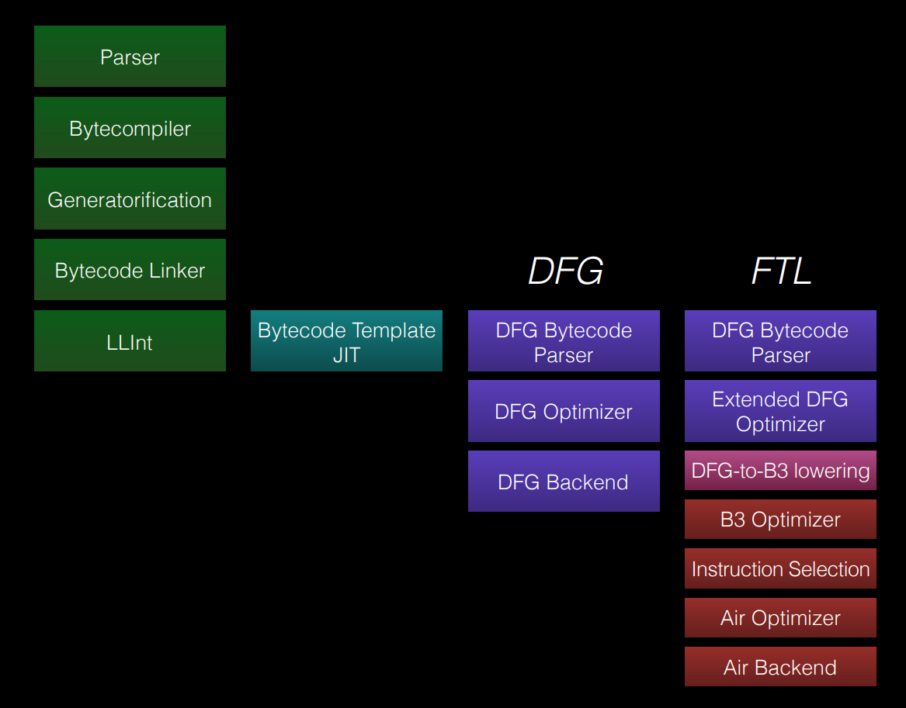
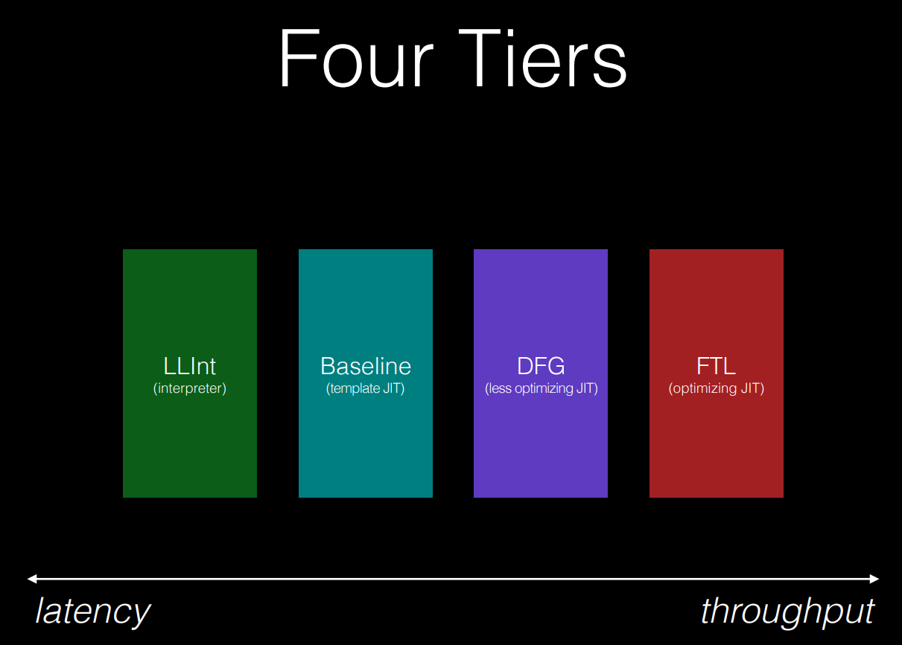

# JavaScriptCore移植

JavaScriptCore是个非常复杂的JS引擎。在尝试移植之前我们先来了解一下它的大致架构，这样在遇到问题的时候可以知道去哪里修改。

## 背景知识

打开JavaScriptCore目录我们能发现非常多的子目录。不用着急，我们后面会一个个介绍每一个部分的用途。一般来说对于一个可执行文件的项目我们总是会找到一个`main`函数入口，对JSC来说也是这样。

### 入口

可能有人会奇怪，JSC不是一个库么，在Linux上它会编译成一个`so`文件供上层组件使用，那怎么会有`main`函数？

答案就是JSC的确是个库，但是它可以非常容易的编译成一个可执行文件单独运行 - 只需要外加一个文件`jsc.cpp`。

你可以在JavaScriptCore的根目录找到这个文件。不过这个单独执行的JSC只是设计用来运行测试用例的，并不等同于NodeJS。

现在让我们打开这个`jsc.cpp`然后找到`main`函数。

```c++
int main(int argc, char** argv)
{
#if OS(DARWIN) && CPU(ARM_THUMB2)
    // Enabled IEEE754 denormal support.
    fenv_t env;
    fegetenv( &env );
    env.__fpscr &= ~0x01000000u;
    fesetenv( &env );
#endif

#if OS(WINDOWS)
    // Cygwin calls ::SetErrorMode(SEM_FAILCRITICALERRORS), which we will inherit. This is bad for
    // testing/debugging, as it causes the post-mortem debugger not to be invoked. We reset the
    // error mode here to work around Cygwin's behavior. See <http://webkit.org/b/55222>.
    ::SetErrorMode(0);

    _setmode(_fileno(stdout), _O_BINARY);
    _setmode(_fileno(stderr), _O_BINARY);

#if defined(_DEBUG)
    _CrtSetReportFile(_CRT_WARN, _CRTDBG_FILE_STDERR);
    _CrtSetReportMode(_CRT_WARN, _CRTDBG_MODE_FILE);
    _CrtSetReportFile(_CRT_ERROR, _CRTDBG_FILE_STDERR);
    _CrtSetReportMode(_CRT_ERROR, _CRTDBG_MODE_FILE);
    _CrtSetReportFile(_CRT_ASSERT, _CRTDBG_FILE_STDERR);
    _CrtSetReportMode(_CRT_ASSERT, _CRTDBG_MODE_FILE);
#endif

    timeBeginPeriod(1);
#endif

#if PLATFORM(GTK)
    if (!setlocale(LC_ALL, ""))
        WTFLogAlways("Locale not supported by C library.\n\tUsing the fallback 'C' locale.");
#endif

    // Need to initialize WTF before we start any threads. Cannot initialize JSC
    // yet, since that would do somethings that we'd like to defer until after we
    // have a chance to parse options.
    WTF::initialize();
#if PLATFORM(COCOA)
    WTF::disableForwardingVPrintfStdErrToOSLog();
#endif

    // We can't use destructors in the following code because it uses Windows
    // Structured Exception Handling
    int res = EXIT_SUCCESS;
    TRY
        res = jscmain(argc, argv);
    EXCEPT(res = EXIT_EXCEPTION)
    finalizeStatsAtEndOfTesting();
    if (getenv("JS_SHELL_WAIT_FOR_INPUT_TO_EXIT")) {
        WTF::fastDisableScavenger();
        fprintf(stdout, "\njs shell waiting for input to exit\n");
        fflush(stdout);
        getc(stdin);
    }

    jscExit(res);
}

```

其中除了前面初始化部分以外最关键的一句是`jscmain(argc, argv);`

进入`jscmain`以后又是一堆初始化。注意前面初始化的是JSC的运行环境，例如WTF。这里的初始化的是对JSC内部对象。

同样的方法，我们发现`jscmain`调用了`runJSC`，然后又进入`runInteractive`，最后也是最关键的，它调用了

```c++
JSValue returnValue = evaluate(globalObject, jscSource(source, sourceOrigin), JSValue(), evaluationException);
```

这里再往后就已经不在`jsc.cpp`内部了。

由此可见这个`evaluate`是JSC的入口**之一**。JSC还有一些其他类似的入口，有兴趣的可以在后面我们谈到WebCore IDL绑定的时候研究一下。

我们再回来看这个入口函数。这个函数定义在`runtime/Completion.h`中。

```c++
JS_EXPORT_PRIVATE JSValue evaluate(ExecState*, const SourceCode&, JSValue thisValue, NakedPtr<Exception>& returnedException);
```

我们给他四个参数：

- 执行状态
- 代码
- this
- 异常

返回一个JSValue的值。

如果对JavaScript有一定了解，在看到这几个参数的时候可能会有一种似曾相识的感觉。从用户的角度来看，JavaScript引擎本质上是一个巨大的状态机，它有一个循环在不停的执行者各种回调函数。我们写的每一行代码都会直接或者间接的被某个回调函数调用。我们自己也可以直接注册这种全局的回调。所以JS引擎的状态在每一次循环执行完毕以后都会回到循环的起始点，这时候由于之前一次调用，JS引擎内部的状态已经改变了。例如我们可以新建一个对象挂在`window`这样的全局对象下面。如果我们把所有能够从根对象访问到的东西看成一棵树，那么这棵树就是`ExecState`。

然后我们还需要提供一个`thisValue`。这就得怪JavaScript语言本身的设计了。熟悉JS的同学可能都曾经有过被这种奇怪的this支配的恐惧把。所以因为JS对this的特殊绑定方式，我们不能像C/C++或者其他静态语言一样把执行过程绑定在一个全局的栈上，而需要在每次运行的时候动态绑定不同的this。

其他参数比较显而易见就不多介绍了。

### 执行流程

从[这里](http://www.filpizlo.com/slides/pizlo-splash2018-jsc-compiler-slides.pdf)借用一张图。它显示的是JSC完整的执行流程。



这个图里面包含了目前JSC除了WASM以外几乎全部的执行流程。从高处看它主要包含下面几个方面：

- 从源代码到bytecode——Parser, Bytecompiler, Linker, etc.
- 解释器——LLINT(Low Level Interpreter)
- 多级即时编译器JIT——DFG，FTL(B3)，etc

这个架构其实是一个典型的编译器架构。比如目前的大多数编译器基本上都是这么几个阶段：

- 从代码到AST
- 从AST到bytecode或者bitcode，不同的编译器会有略不一样的选择。
- bytecode到assembly。有一次生成的，也有多次优化的。

比如基于LLVM的编译器多多少少都是这样的架构。

与传统编译器不同的是，JSC每一步都是可以执行的，而不像传统编译器大多数都以得到最终的可执行文件为目标。比如在上面图中我们可以单独运行LLInt，或者单独运行DFG，FTL等，对同一段代码他们都会得到同样的结果。可能有人会问那为什么不直接一步到位呢。

答案是需要在延迟和性能之间取一个平衡(Latency vs performance)。



有兴趣的可以仔细读一下上面这个PDF。简单地说就是生成解释器需要的bytecode时间非常短，而生成高度优化的二进制需要时间。不仅仅是编译的时间，还有获取profile然后针对性优化的时间。同时JIT还会造成非常大的内存消耗。所以对于一些简单的，只执行一两次的代码，花很多时间和内存去做优化编译是得不偿失的。

### 解释器 LLInt

如果你读完上面的部分，你可能会觉得既然JSC的每一个Tier都可以单独执行，那么我如果能把JSC砍到只剩一个LLInt那不是应该很容易移植吗，因为大多数解释器都不涉及到需要动态申请可执行内存，也不会需要平台相关的汇编，可以看成一个C/C++实现的巨大的`switch-case`。事实上的确是这样的，不过也并不是这么简单，后面我们会详细探讨这个问题。

对嵌入式系统来说很多时候需要在限定的二进制尺寸下完成特定的功能。因为嵌入式设备有各方面的限制，不可能拥有像桌面电脑一样丰富的资源。从这一点来看LLInt似乎非常的合适——它能砍掉非常多的代码，几乎所有JIT相关的都不再需要。它可以节省很多动态内存，因为JIT是吃内存大户。同时它在功能上和高级别的Tier——DFG、FTL JIT几乎没有差别。“**几乎**” 是指像WASM这样必须依赖JIT的功能目前还没办法在JSC中解释执行，但是其他所有我们能想到的JavaScript功能它都是支持。

在深入到LLInt之前，我觉得可以先动手尝试一下JSC，运行一些简单的JavaScript。比如我们可以手动执行一下上面提到的JSC shell (`jsc.cpp`)，打几个命令看看输出。在能够运行JSC以后可以试着用`gdb`启动它，设几个断点然后跟踪一下执行流程。这对于了解代码非常有帮助。

编译和运行JSC shell可以参考WebKit官方的指南，我就不复制粘贴了。`Tools/scripts/run-jsc-stress-tests`是一个非常好的参考，可以看看它是怎么调用JSC来跑测试用例的。比如在这个脚本里面我们会发现JSC Shell支持 `--useLLInt=true`和 `--no-jit`，顾名思义就是关闭JIT然后只使用LLInt。

在看下面内容之前我非常建议先尝试运行和调试一下JSC。

如果试着单步执行的话，可能你会发现当你用gdb挂上了正确的symbol，加载了源代码以后还是会执行到一些看起来像汇编但又不是汇编的东西。像下面这样：

```
OFFLINE_ASM_OPCODE_LABEL(op_enter)
    "\tmovq 16(%rbp), %rdx\n"g
    "\tmovl 24(%rdx), %edx\n"g
    "\tsubq $4, %rdx\n"g
    "\tmovq %rbp, %rsi\n"g
    "\tsubq $32, %rsi\n"g
    "\ttestl %edx, %edx\n"g
    "\tjz " LOCAL_LABEL_STRING(_offlineasm_opEnterDone) "\n"
    "\tmovq $10, %rax\n"g
    "\tnegl %edx\n"g
    "\tmovslq %edx, %rdx\n"g
```

恭喜你已经找到了LLInt的bytecode代码。

#### LLInt目录

我们先打开JavaScriptCore目录下的`llint`子目录。目录里面文件不多，重要的是下面几个：

- LLIntCLoop.cpp // LLInt “CLoop”初始化代码
- LLIntEntrypoint.cpp // JavaScript进入LLInt的入口
- LLIntOffsetExtractor.cpp // 地址提取器
- LLIntSettingsExtractor.cpp // 设置提取器
- LowLevelInterpreter.asm 以及其他asm文件 // bytecode伪汇编实现
- LowLevelInterpreter.cpp // LLInt解释器主循环

上面这些东西看起来会比较奇怪，不用着急我们下面都会说到。

#### Bytecode

上面提到过JSC并不直接解释JavaScript，而是先通过parser把JavaScript转换成AST，然后再用Bytecompiler把AST变成bytecode。这些部分并不是LLInt的一部分，因为他们只是执行直接的解析和转换。

我们可以在JavaScriptCore目录下可以找到`parser`和`bytecode`目录分别对应上述功能。现在我们来看一下bytecode到底是什么样子。

向上翻半页，回到我们之前看到过的那一段奇怪的汇编会发现开头的一段看起来似乎不太一样：

```
OFFLINE_ASM_OPCODE_LABEL(op_enter)
```

这其实是一个宏，它的展开也很简单——变成一个label。你们可以在`LowLevelInterpreter.cpp`里找到这段宏的定义。

看到这个label是不是忽然想到了什么？解释器大循环和`switch-case`？没错！所有的bytecode最终都会变成这样的汇编，然后被塞到那个超大的`switch-case`循环里面去。

我们再来看这一行，里面还有一个`op_enter`，看起来像字节码。它就是JSC的Opcode(或者bytecode)。不过这里的汇编代码都是生成出来的，你如果在gdb里面追踪这个代码的路径会发现这是个头文件，叫做`LLIntAssembly.h`，并且是在编译生成的某个目录下面，并不是在源代码目录下面。它的生成过程有点复杂，一步步来讲。

首先我们到`bytecode`目录下面找一个叫做`BytecodeList.rb`的文件。打开后发现这个文件中罗列了非常多的opcode**声明**。例如：

```
op :enter

op :get_scope,
    args: {
        dst: VirtualRegister
    }

op :create_direct_arguments,
    args: {
        dst: VirtualRegister,
    }
```

我们上面看到的`op_enter`就在这里。它是一个没有参数的opcode。后面的很多opcode在args里面会有不一样数量的参数和定义。所以我们在这儿看到的是opcode的**声明**，也就是所有对于使用者来说需要的信息。而opcode的真正定义在别的地方。为了便于理解，参考下面的图：

```
JavaScript ---> Parser -> AST -> Bytecompiler -> opcode ---> LLInt
// 使用者 <---> opcode <---> 执行者
```

Bytecompiler左边把JavaScript变成opcode，所以它不需要知道每个opcode做什么。

LLInt按顺序执行opcode，所以它需要定义每个opcode的行为。

顺理成章的，我们知道应该去哪里找opcode的定义了——LLInt目录里。

不过在进入LLInt目录之前我们再回来看一下上面这个`BytecodeList.rb`的文件，因为我们还不清楚这个Ruby文件怎么最终会和JSC的其他代码编译到一起去的。如果我们搜索这个文件名，会发现在`JavaScriptCore/CMakeLists.txt`里有这样一行：

```cmake
add_custom_command(
    OUTPUT ${DERIVED_SOURCES_JAVASCRIPTCORE_DIR}/Bytecodes.h ${DERIVED_SOURCES_JAVASCRIPTCORE_DIR}/InitBytecodes.asm ${DERIVED_SOURCES_JAVASCRIPTCORE_DIR}/BytecodeStructs.h ${DERIVED_SOURCES_JAVASCRIPTCORE_DIR}/BytecodeIndices.h
    MAIN_DEPENDENCY ${JAVASCRIPTCORE_DIR}/generator/main.rb
    DEPENDS ${GENERATOR} bytecode/BytecodeList.rb
    COMMAND ${RUBY_EXECUTABLE} ${JAVASCRIPTCORE_DIR}/generator/main.rb --bytecodes_h ${DERIVED_SOURCES_JAVASCRIPTCORE_DIR}/Bytecodes.h --init_bytecodes_asm ${DERIVED_SOURCES_JAVASCRIPTCORE_DIR}/InitBytecodes.asm --bytecode_structs_h ${DERIVED_SOURCES_JAVASCRIPTCORE_DIR}/BytecodeStructs.h --bytecode_indices_h ${DERIVED_SOURCES_JAVASCRIPTCORE_DIR}/BytecodeIndices.h ${JAVASCRIPTCORE_DIR}/bytecode/BytecodeList.rb
    VERBATIM)
```

这里可以看到这个ruby文件会用于生成`Bytecodes.h`。我们打开`Bytecodes.h`会发现它里面用宏的方式定义了每一个opcode。这样一方面可以解耦编译器的前端和后端，另一方面可以很便捷的自动生成大量bytecode相关的代码，而不需要手动一个个的重复添加。

#### Bytecode的实现

上面贴的几个opcode里面有一个是这样的`op :get_scope,`，那我们就搜索一下LLInt目录看看有没有相似的。于是搜索`get_scope`会发现我们找到了竟然不止一个地方：

```asm
// 在LowLevelInterpreter32_64.asm 中

llintOpWithReturn(op_get_scope, OpGetScope, macro (size, get, dispatch, return)
    loadi Callee + PayloadOffset[cfr], t0
    loadp JSCallee::m_scope[t0], t0
    return (CellTag, t0)
end)
```

同时

```asm
// 在LowLevelInterpreter64.asm 中

llintOpWithReturn(op_get_scope, OpGetScope, macro (size, get, dispatch, return)
    loadp Callee[cfr], t0
    loadp JSCallee::m_scope[t0], t0
    return(t0)
end)
```


### JIT

### Runtime

### Yarr

