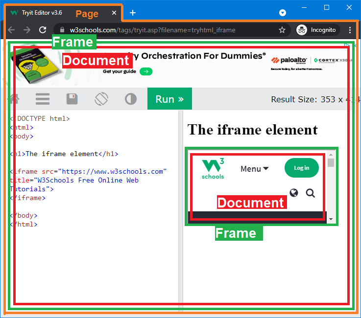
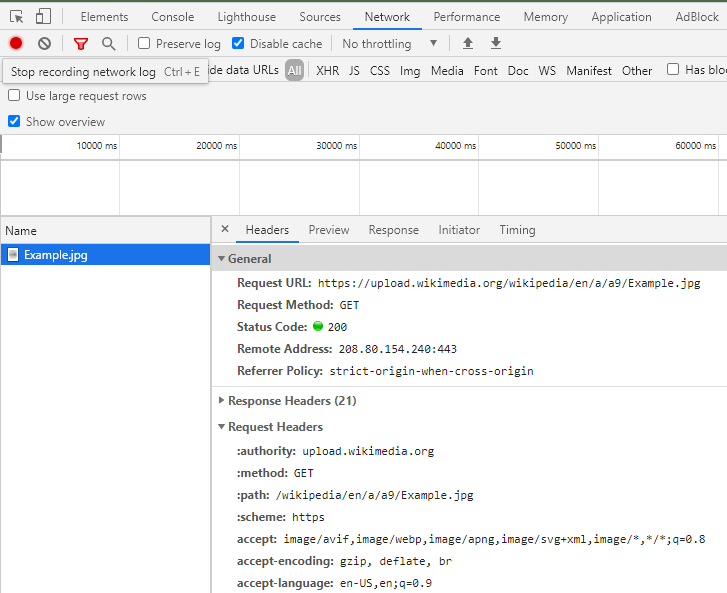

# WebCore移植

相对于JavaScriptCore来说WebCore的代码量大了很多倍，但是整体编译过程的复杂度却稍好一些，因为没有JSC那么多涉及到汇编和各种伪代码转换的复杂步骤。编译过程中最复杂的一个步骤基本上就是IDL生成C++绑定的过程了。我们还像之前一样先了解一些背景知识。

## 背景知识

### Forwarding headers

如果还没有看过[WebKit的编译过程](Contents/Compilation.md)的话，我建议先读一下这个章节，尤其是里面关于forwarding header的部分。

因为WebCore依赖JavaScriptCore，而WebCore本身又会被上层组件使用，所以WebCore既依赖JSC提供的forwarding headers，又需要对WebKit和WebKitLegacy提供自己的forwarding header。

WebKit 的Forwarding headers是通过`generate-forwarding-headers.pl`生成的。在之前的文章中我们提到过Forwarding headers常常是被复制到一个目录中去的，所以在WebCore和其他依赖WebCore的组件中使用这个头文件的方法是不同的。例如`WebCore/dom/Document.h`文件在WebCore中使用的时候始终是：

```c++
#include "Document.h"
```

而在其他模块例如WebKit/WebKitLegacy中使用方式是：

```c++
#include <WebCore/Document.h>
```

所以我们能看到一个特征：如果我们需要在WebCore以外使用一个WebCore的头文件，那么它出现的格式一定是如上所示的。所以我们可以根据这个特征来生成所有需要的Forwarding headers。而`generate-forwarding-headers.pl`就是这么做的。这个Perl脚本会遍历所有用到WebCore头文件的地方，然后再找到对应的目录，例如上面的`Document.h`出现在`WebCore/dom`下面，那么最终这个`Document.h`会被复制到`/building_dir/<some other folders>/ForwardingHeaders/WebCore/Document.h`。由于`ForwardingHeaders`是其他依赖WebCore项目的头文件路径之一，那么使用`#include <WebCore/Document.h>`就会顺理成章的找到这里。

### 线程模型

虽然线程模型和对象关系与WebCore的移植没有直接联系，但是他们对于理解WebCore非常的重要。

WebCore从最初的设计开始基本上一直沿用的是一个单线程的设计，也就是说绝大多数涉及到HTML和JS的事情都在一个线程里面完成。比如页面的下载，解析，生成dom树，渲染树，执行页面中内嵌的JS等等。在这么多年的改进中WebCore的部分功能被挪到了一些其他的辅助线程里面去，包括渲染合成器TextureMapper，页面下载等等，但是主要的框架依然没有太大的变化。一部分原因是初始设计加上很多年的功能添加使得大型重构变得困难，另一方面是因为标准的规定。例如JS需要在dom线程中执行就是标准规定的。想要跳过这个限制首先需要从标准入手，例如web worker。

所以我们大致可以把WebCore理解成一个单线程的大循环，循环的起点是`WTF::RunLoop::run()`，然后在每一次循环中：

- 页面资源加载(`WebCore::ResourceLoader`)
- 页面解析(`WebCore::HTMLDocumentParser`)
- 构造DOM tree(`WebCore::document`)
- 构造Render tree(`WebCore::RenderView`)
- 构造Compositor layer tree(`WebCore::GraphicsLayer`)
- 执行JavaScript(`WebCore::ScriptController` --> `JSC::execute()`)

WebCore中绝大多数的*类*都是*非线程安全*的，所以他们一般只能在主线程中被调用。在非主线程中访问任何WebCore的对象都需要十分的小心。

WebCore的另一个设计就是它的*异步执行*。JavaScript的异步执行大家应该都很熟悉，WebCore的设计本质上也是这样的。很多任务如果不需要同步执行的时候会通过`WTF::Function`封装成闭包，然后扔到主循环`WTF::RunLoop`的队列中去。例如部分`Layout`工作，`GraphicsLayer` tree同步等等，这些很多时候都是这样异步执行的。

*异步执行*有时候也会受到JS代码的影响。一个典型的例子是我们如果在页面中创建了一个DOM element：

```javascript
// From https://developer.mozilla.org/en-US/docs/Web/API/Document/createElement
function addElement () {
  // create a new div element
  const newDiv = document.createElement("div");

  // and give it some content
  const newContent = document.createTextNode("Hi there and greetings!");

  // add the text node to the newly created div
  newDiv.appendChild(newContent);

  // add the newly created element and its content into the DOM
  const currentDiv = document.getElementById("div1");
  document.body.insertBefore(newDiv, currentDiv);
}
```

这时候WebCore一般是*不会*做同步Layout的，因为我们只是在代码里创建了这个对象，而至于这个对象什么时候被渲染，然后被用户看见等等，并不会对我们的代码产生任何影响。但是如果我们加这一行：

```javascript
console.log(newDiv.clientHeight);
```

这时候Layout就是必须的，因为只有重新排版以后我们才能知道这个`newDiv`有多高。在执行这一行JavaScript之前“脏”页面会被强制重排版。

所以这里我们可以总结这么几点：

- WebCore总体的设计目前依然是非常强的单线程模型。
- 只有一些对性能影响很大的部分被单独剥离了主线程，例如部分图形渲染。
- 在WebCore主线程中很多时候通过异步调用来降低响应时间。
- 大多数时候JavaScript的执行和DOM的解析+排版+渲染都在同一个线程中。(有特殊例外，如web worker)

所以如果你在调试WebCore的时候下了个断点，然后发现极其壮观的调用堆栈。函数调用在WebCore和JSC中来回穿梭，不要惊讶因为设计就是这样的。

### 对象关系

这里我们看几个WebCore里面比较重要和常见的类。

**Page**

总体上WebCore的对相关系是一棵树，它的树根往往是`Page`对象，在`Page`下面挂着`Frame`，然后是`Document`。我们以一个普通的浏览器界面为例：



一般来说我们每一个tab都是一个页面。这里tab对应的就是Page对象。Page对象不负责具体页面内部的渲染，因为Page包着`Farme`，那些事情是Frame来做的。Page会做例如下面这些事情：

- 控制页面缩放。
- 用户输入。
- 焦点（focus）控制。
- inspector的连接。
- 用户定制style。

等等。

代码位置是`WebCore/page/Page.h`

**Frame**

在这个头文件里面我们可以找到这样一行：`Ref<Frame> m_mainFrame;`，代表每个Page都有一个成员，叫做`m_mainFrame`。这个`Frame`对象就是网页渲染和执行的主入口。Frame对象也可以有儿子节点，例如上面的图中主Frame有一个*iframe*。*iframe*也是一样通过Frame对象来访问的。Frame主要做下面这些事情：

- 页面加载。
- 前进后退。
- 用户输入。
- 脚本控制(`ScriptController`)

`ScriptController`是一个非常重要的对象，它是连接DOM和JavaScript的桥梁。这里着重需要注意的是这个对象是Frame的成员，而不是Document，所以它的生命周期一般会长于Document。

**Document**

Frame负责加载页面，那么页面加载完以后也就顺理成章的可以生成DOM了。这里Document对象就是DOM在WebCore中的实现。正因为是Frame加载了页面，所以很显然Frame可以清空，替换，或者修改它的Document成员。也就是说在Frame中`m_doc`可能是空，代表页面还没有加载，也可能会在某个时候被替换掉，例如前进后退等等。

在我们有了Document以后WebCore会对它进行进一步处理，包括解析(parse)，执行其中的JavaScript，生成Render tree以及在需要的时候生成GraphicsLayer tree。这些从逻辑上都依赖Document，所以他们的生命周期都和这个Document绑定。一般情况下像Render tree这一类对象都直接或者间接的是Document的成员。

### IDL

IDL是什么？

> The [Web IDL](http://www.w3.org/TR/WebIDL/) is a language that defines how WebCore interfaces are bound to external languages such as [JavaScriptCore](https://trac.webkit.org/wiki/JavaScriptCore), ObjC, and GObject. You need to write IDL files (e.g. XMLHttpRequest.idl, Element.idl, etc) to expose WebCore interfaces to those external languages. When WebKit is built, the IDL files are parsed, and the code to bind WebCore implementations and [JavaScriptCore](https://trac.webkit.org/wiki/JavaScriptCore), ObjC, and GObject interfaces is automatically generated.

https://trac.webkit.org/wiki/WebKitIDL

IDL是连接JavaScript和WebCore的纽带。在引入复杂的东西之前，我们先从大多数人都熟悉的内容开始。

我们先打开Chrome或者Safari的web inspector，切换到console tab，输入下面这些代码：

```javascript
let img = document.createElement("img");
img.src="https://upload.wikimedia.org/wikipedia/en/a/a9/Example.jpg";
img.decode();
```

这几行代码非常好理解，我们创建了一个`img`对象，给他一个地址，然后调用`decode`函数。

这时候我们再切换到Network tab，在Filter里面填入wikimedia，我们可以看到如下的信息



这说明浏览器确确实实在我们敲下那几行代码以后去下载了这个图片。

好了，这里我们要开始问几个问题了：

- 我们上面那段代码是在哪里运行的？
- “下载图片“这个功能是在哪里实现的？
- decode是在哪里做的？
- 最关键的，`img`这个对象到底存储在哪里？

如果不是很确定的话，下面我们慢慢来分析这些问题。

首先我们从第一行代码`let img = document.createElement("img")`开始。这行代码的特殊之处在于，它跨越了JSC和WebCore的边界。这怎么理解呢？

我们不妨先来看下面这一行：

```javascript
let date = new Date();
```

与上面的`document`不同，这里`Date`是一个JavaScript runtime组件，任何一个满足标准的JavaScript引擎都会有这样的一个库，例如JSC，或者V8。所以当我们即使在Node.js控制台里面输入这一行代码的时候它依旧是可以运行的，因为它是JavaScript的一部分。但我们上面第一行代码中的`document`不是。感兴趣的可以去Node.js下面试试看，它会告诉你`window`和`document`都是`undefined`。

回到我们在inspector里面敲的三行代码，实际上这个`document`并不是一个根对象，而是挂在`window object`下面。这个`window`对象就是我们经常说的`global scope`。当我们在浏览器中运行JavaScript的时候，浏览器会在初始化JavaScript引擎以后向其中注入所有浏览器的绑定对象，例如`window`，同时在运行JavaScript的时候会将当前scope设置成`window`。

所以现在我们虽然依然不能回到上面哪些问题，但是我们能够大致的知道代码的执行流程是下面这样的：

```
JavaScriptCore(开始执行) ----> WebCore(使用了DOM对象) ----> JavaScriptCore(执行完毕)
```

实际上由于JavaScript总是起始于某一个HTML页面（可以是内嵌script或者link），JavaScript的运行起点是从WebCore的某个地方发起的。我们加上它以后就是下面这样：

```
WebCore(解析页面，遇到JS) ----> JavaScriptCore(开始执行) ----> WebCore(使用了DOM对象) ----> JavaScriptCore(执行完毕)
```

如果这个页面里面没有JS，例如`example.com`，那么第二步就不会开始。所以WebCore本身是可以作为一个纯HTML解析器来工作的。

有了这四个步骤，我们下面就可以一步步的来分析代码是如何在两个库之间跳转的。

#### WebCore页面下载

对于浏览器来说绝大多数的JavaScript都是由某个页面发起的，所以第一步其实是下载包含`<script>`标记的页面，或者循着URL下载某一个JS文件然后执行它。从上面`Page`,`Frame`和`Document`的相互关系来看，我们大概能知道这一步发生在`Frame`和`Document`中。这里的细节就不展开太多了，大致的步骤如下：

- `FrameLoader`生成一个新的`DocumentLoader`来加载目标页面。
- `DocumentLoader`通过底层http支持库(curl)异步下载页面。
- 下载完成以后会回调到`DocumentLoader::commitLoad()`来提交页面内容。
- 页面的提交(commit)也就意味着这时候开始执行**同步**解析(parsing)，然后如果碰到JavaScript则会去执行。

#### 运行环境的准备

从前面讲JSC的章节我们知道调用`JSC::execute()`需要提供几个参数，例如上下文(ExecState)，this等等。然后这里因为我们是从WebCore中调用JSC，所以我们还需要准备好JSC和WebCore之间的“桥梁”。所以这里我们分别来研究这个准备阶段需要的东西。

**VM**

JSC的VM可以看成对于当前线程的一个虚拟机的抽象。它有下面几个特征：

- VM负责JSC运行环境的管理。例如堆内存，调试器inspector，profiler等等。
- 一个VM中可以支持多个不同的运行上下文。比如我们可以有好几个不同的JS环境同时执行，互相之间并不影响。

- 目前在JSC中的设计是VM和线程是1:1对应的。我们又知道WebCore严重依赖它的主线程，所以基本上WebCore里面一般只会存在一个VM，这个VM则对应WebCore的主线程。

**DOMWrapperWorld**

这个类可以看成是“桥梁”的一个非常重要的部分。它一头连接着`VM`，另一头连接着`WindowProxy`。所以它的主要作用是把WebCore和JSC两边的上下文对象连接在一起。

- `VM`和`DOMWrapperWorld`**一般**来说是一对一的关系。这里要注意的是“一般”情况是这样，但是在某些特殊情况下，比如一些特殊的插件需要运行在受限环境中的时候WebCore会创建一个不同的`DOMWrapperWorld`来执行。不过绝大多数情况都是只有一个`mainThreadNormalWorld`在那里。
- 既然`DOMWrapperWorld`一般就一个，那么当我们有多个window 上下文的时候(例如多个iframe)这些不同的window都会连接到这一个对象上。

**WindowProxy**

顾名思义，这是个“代理”，它代理的是Window。这里暂不管这个Window对象到底是什么，但是我们已经知道每次提到Window多多少少和Dom有关系，所以它很有可能不止一个。在`DOMWrapperWorld.h`中我们可以看到：

```c++
HashSet<WindowProxy*> m_jsWindowProxies;
```

这里它是一个HashSet，表明这个全局的`DOMWrapperWorld`是可以对应多个不同的Window的。

我们找到`WindowProxy`的头文件，它的位置是`WebCore/bindings/js/WindowProxy.h`。从头文件里面我们发现它指向了三个东西：

- `AbstractDOMWindow` - 这是一个抽象类，实际实现的对象是`DOMWindow`
- `AbstractFrame` - 也是一个抽象类，实际对象是`Frame`
- `JSWindowProxy` - 非常重要的一个对象，它连接着`JSDOMWindow`。

到这里我们发现已经快要到达Frame和DOM了，但是还有一个非常重要的类没有讲，就是上面这个`JSDOMWindow`。

**JSDOMWindow**

它就是我们所说的JS中的Global Object。

这里它不是包装了一个别的什么类，或者又指向了哪里，它本身**就是**Global Object。也就是说我们在浏览器inspector的console里面输入`window`，接触到的就是它。它有几个特性：

- 每个Frame一般都对应一个`JSDOMWindow`。
- 这个类是一个JSC object。它的继承树是：`JSDOMWindow -> JSDOMWindowBase -> JSDOMGlobalObject -> JSC::JSGlobalObject`。发现没有，它最终是一个`JSC::JSGlobalObject`
- 这个类是**IDL生成的**。你必须在编译的中间目录里才能找到这个文件，源代码目录里面不包含它的C/C++代码，只有供生成他们的IDL文件。

我猜很可能看到这里你都快晕了，这么多类互相连接。我们画个图来捋一下。

```
              ┌───────────────┐   ┌──┐
              │DOMWrapperWorld├───►VM│
              └───────────▲──▲┘   └──┘
┌─────┐                   │  │
│Frame│                   │  │
└─┬──┬┘                   │  │
  │  │ ┌────────────────┐ │  │
  │  └─►ScriptController│ │  │
  │    └────────────────┘ │  │
  │                       │  │
  │    ┌───────────┬──────┘  │
  └────►WindowProxy│         │  ┌─────────────┐  ┌───────────┐
       └───────────┴─────────┼──►JSWindowProxy├──►JSDOMWindow│
                             │  └─────────────┘  └───────────┘
 ┌─────┐                     │
 │Frame│                     │
 └─┬──┬┘                     │
   │  │ ┌────────────────┐   │
   │  └─►ScriptController│   │
   │    └────────────────┘   │
   │                         │
   │    ┌───────────┬────────┘
   └────►WindowProxy│           ┌─────────────┐  ┌───────────┐
        └───────────┴───────────►JSWindowProxy├──►JSDOMWindow│
                                └─────────────┘  └───────────┘
```

 注意这里右边的VM以及所有JS开头的类都是JSC的对象，而左边部分都是WebCore对象。

JSC的对象有个特征，就是他们往往都是以JS开头。例如`JavaScriptCore/runtime`下面的很多标准定义的对象，如`JSPromise`; `WebCore/bindings/js`下面**手动实现**的很多Web运行时对象，例如`JSEventCustom`；以及编译中间目录下面的所有由IDL生成的文件，例如`JSDOMWindow`。你可能会比较困惑，什么是”手动实现“？这个和IDL的生成过程有关，我们下面会讲到。

#### IDL绑定对象的调用

我们依然回到最开始的三行代码。在有了上面这些铺垫以后我们再来看一下它在WebCore中的执行过程。

```javascript
let img = document.createElement("img");
img.src="https://upload.wikimedia.org/wikipedia/en/a/a9/Example.jpg";
img.decode();
```

如果你已经按照WebKit的教程编译了WebKitGTK或者WebKitWPE，可以尝试着在`WebCore::HTMLImageElement::decode()`里面下一个断点，然后运行上面的代码会大致得到这样一个运行堆栈：

```c++
WebCore::HTMLImageElement::decode()
WebCore::jsHTMLImageElementPrototypeFunctionDecodeBody()
WebCore::IDLOperationReturningPromise<WebCore::JSHTMLImageElement>::call::__l2::<lambda>()
WebCore::callPromiseFunction<0,__int64 <lambda>()>() functor)
WebCore::IDLOperationReturningPromise<WebCore::JSHTMLImageElement>::call<&WebCore::jsHTMLImageElementPrototypeFunctionDecodeBody,0,2>()
WebCore::jsHTMLImageElementPrototypeFunctionDecode()
JSC::NativeFunction::operator()()
JSC::CLoop::execute()
vmEntryToJavaScript()
JSC::JITCode::execute()
JSC::Interpreter::executeProgram()
JSC::evaluate()
JSC::profiledEvaluate()
WebCore::JSExecState::profiledEvaluate()
WebCore::ScriptController::evaluateInWorld()
WebCore::ScriptController::evaluate()
WebCore::ScriptElement::executeClassicScript()
WebCore::ScriptElement::prepareScript()
WebCore::HTMLScriptRunner::runScript()
WebCore::HTMLScriptRunner::execute()
WebCore::HTMLDocumentParser::runScriptsForPausedTreeBuilder()
WebCore::HTMLDocumentParser::pumpTokenizerLoop()
WebCore::HTMLDocumentParser::pumpTokenizer()
WebCore::HTMLDocumentParser::pumpTokenizerIfPossible()
WebCore::HTMLDocumentParser::append()
WebCore::DecodedDataDocumentParser::appendBytes()
WebCore::DocumentWriter::addData()
WebCore::DocumentLoader::commitData()
WebCore::WebFrameLoaderClient::committedLoad()
WebCore::DocumentLoader::commitLoad()
WebCore::DocumentLoader::dataReceived()
WebCore::DocumentLoader::dataReceived()
WebCore::CachedRawResource::notifyClientsDataWasReceived()
WebCore::CachedRawResource::updateBuffer()
WebCore::SubresourceLoader::didReceiveDataOrBuffer()
WebCore::SubresourceLoader::didReceiveBuffer()
WebCore::ResourceLoader::didReceiveBuffer()
WebCore::CurlResourceHandleDelegate::curlDidReceiveBuffer()
WebCore::CurlRequest::didReceiveData::__l22::<lambda>()
WTF::Function<void()>::CallableWrapper<void <lambda>()>::call()
WTF::Function<void()>::operator()()
WebCore::CurlRequest::callClient::__l2::<lambda>()
WTF::Function<void()>::CallableWrapper<void <lambda>()>::call()
WTF::Function<void()>::operator()()
WTF::dispatchFunctionsFromMainThread()
WTF::MainThreadDispatcher::fired()
WTF::RunLoop::Timer<WTF::MainThreadDispatcher>::fired()
WTF::RunLoop::TimerBase::start::__l2::<lambda>()
WTF::Function<void()>::CallableWrapper<void <lambda>()>::call()
WTF::Function<void()>::operator()()
WTF::RunLoop::TimerBase::ScheduledTask::fired()
WTF::RunLoop::runImpl()
WTF::RunLoop::run()
```

看起来有点吓人，但是我们可以稍微整理一下：

```c++
// In the WebCore, in HTMLImageElement.cpp
WebCore::HTMLImageElement::decode()

// Back to the WebCore, in IDL binding generated code JSHTMLImageElement.cpp
WebCore::jsHTMLImageElementPrototypeFunctionDecode()

// Back to native function
JSC::NativeFunction::operator()()

// Interpreter & JIT
JSC::JITCode::execute()
JSC::Interpreter::executeProgram()

// JSC entrance
JSC::evaluate()

// Script runner...
WebCore::ScriptController::evaluateInWorld()
WebCore::ScriptElement::prepareScript()
WebCore::HTMLScriptRunner::runScript()
WebCore::HTMLScriptRunner::execute()

// HTMLDocumentParser...
WebCore::HTMLDocumentParser::runScriptsForPausedTreeBuilder()
WebCore::HTMLDocumentParser::pumpTokenizerLoop()
WebCore::HTMLDocumentParser::append()

// ResourceLoader & DocumentLoader...
WebCore::DocumentLoader::commitData()
WebCore::ResourceLoader::didReceiveBuffer()

// Curl callback...
WebCore::CurlResourceHandleDelegate::curlDidReceiveBuffer()

// WTF::RunLoop & function callback ...
WTF::RunLoop::run()
```

这里我简单的清理了一下堆栈，然后加了一些注释。调用过程是从下向上的。

- 首先我们已经知道了WebCore本质上就是个超大的消息循环。每次它的出发点都是`WTF::RunLoop`

- 然后这一次执行的任务是一个`curlDidReceiveBuffer`函数，表明网络层(curl)已经接收到了数据，可以发送给WebCore来处理了。

- 接着就是ResourceLoader和DocumentLoader。通过这些Loader我们可以从一个资源找到它所归属的页面。例如`Resource -> ResourceLoader -> DocumentLoader -> Document`。这样就一层层的向上找到了发出请求的页面。

- `HTMLDocumentParser`开始解析页面。

- 解析页面的时候遇到了`ScriptElement`。这里的JavaScript是需要同步执行的，所以HTML解析器暂停执行(`runScriptsForPausedTreeBuilder`)，控制权转移到`ScriptElement::executeClassicScript`。

- `ScriptController`做跳入JSC前的准备。

  - 注意之前我们在Frame初始化的时候已经把`VM`,`DOMWrapperWorld`，`WindowProxy`以及`JSDOMWindow`等必要的桥梁搭建好了，这时候我们只需要沿着桥梁走过去就行。如果打开`ScriptController.cpp`可以看到下面这样的代码：

  - ```c++
    JSValue ScriptController::evaluateInWorld(const ScriptSourceCode& sourceCode, DOMWrapperWorld& world, ExceptionDetails* exceptionDetails)
    {
        /// incomplete code...
        auto& proxy = jsWindowProxy(world);
        auto& exec = *proxy.window()->globalExec();
        const String* savedSourceURL = m_sourceURL;
        m_sourceURL = &sourceURL;
    
        JSValue returnValue = JSExecState::profiledEvaluate(&exec, JSC::ProfilingReason::Other, jsSourceCode, &proxy, evaluationException);
    ```

  - 上面的函数我删除了一部分，保留的关键的部分显示了我们在跳转至JSC之前会做的几件事情：

    - 准备好`JSWindowProxy`。
    - 准备上下文context，也就是`ExecState`
    - 把proxy对象作为this指针传过去。

- 进入`JSC::evaluate()`，正式进入JSC。

- 解释器和JIT的执行。

- 遇到NativeFunction，跳出Interpreter/JIT。

  - 所谓NativeFunction是指在JavaScript环境中的那些非JavaScript代码。如果我们写一个`function a() {}`，定义一个函数`a`，那么这个a函数是纯JavaScript函数，所以运行的时候不需要跳出解释器和JIT，因为代码本身就定义在JavaScript的运行环境中。相反如果我们调用`console.log()`，这个函数因为是由浏览器实现的，JavaScript必须借助浏览器才能完成任务，所以这个函数是NativeFunction。
  - 如果我们在Chrome的inspector里面输入`console.log`，会得到`ƒ log() { [native code] }`，表明这个函数的函数体是native code。

- 回到`WebCore::jsHTMLImageElementPrototypeFunctionDecode()`。这里执行过程已经到了WebCore的IDL生成的代码。如果搜索这个函数的位置，可以发现它的代码是`JSHTMLImageElement.cpp`，和我们上面的`JSDOMWindow`一样，都是在编译过程中的临时目录里。这就是完全由IDL生成器转换得到的C++代码。

- 最后一步，我们走到`WebCore::HTMLImageElement::decode()`，表明执行过程正式回到了WebCore内部。

## IDL到C++的转换

有了以上的背景知识，我们可以开始探究一下在WebCore的编译过程中这些事情是怎么被一步步完成的。首先我们依然拿`HTMLImageElement::decode()`做一个范例。其他的IDL基本上大同小异，可以以此类推。

我们先找到`HTMLImageElement`的位置，它在`WebCore/html/HTMLImageElement.h/cpp`。在他们附近我们能找到一个文件名类似，仅仅扩展名不同的文件`HTMLImageElement.idl`。有了这两部分还不够，我们还需要继续找两个叫做`JSHTMLImageElement.h/cpp`的文件，他们一般都在WebKit的build目录的某个较深的子目录中，大家可以用搜索工具找一下。

找到了这三个部分以后可以对应到前面讨论过的调用过程，去寻找`decode()`函数在他们中的位置：

- `JSHTMLImageElement.cpp`

  - ```c++
    static inline JSC::EncodedJSValue jsHTMLImageElementPrototypeFunctionDecodeBody(JSC::ExecState* state, typename IDLOperationReturningPromise<JSHTMLImageElement>::ClassParameter castedThis, Ref<DeferredPromise>&& promise, JSC::ThrowScope& throwScope)
    {
        UNUSED_PARAM(state);
        UNUSED_PARAM(throwScope);
        auto& impl = castedThis->wrapped();
        impl.decode(WTFMove(promise));         // <------------- 注意这里
        return JSValue::encode(jsUndefined());
    }
    ```

- `HTMLImageElement.idl`

  - ```
    interface HTMLImageElement : HTMLElement {
        // ...
        Promise<void> decode();
    };
    ```

- `HTMLImageElement.cpp`

  - ```c++
    void HTMLImageElement::decode(Ref<DeferredPromise>&& promise)
    {
        return m_imageLoader.decode(WTFMove(promise));
    }
    ```

在第一段中标注“注意这里”的地方我们能看到一个`impl`对象，它是由`this->wrapped()`得到的。

toJS toWrapped.


#### Custom Bindings


## 必要的功能模块以及第三方依赖库
